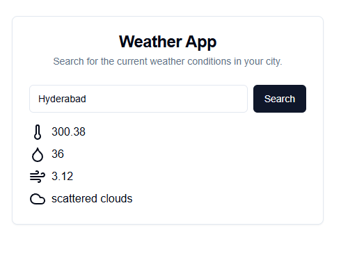

# WeatherApp

Steps to run backend : 

Run the following commands for installation
```
cd weather-backend
npm i
```
Create a .env file and add your open weather api key as below
```
OPENWEATHER_API_KEY=YOUR_API_KEY
```

Run the following command to start the server:
```
npx ts-node src/server.ts
```


Steps to run frontend : 
Run the following commands for installation
```
cd weather-frontend
npm i
```
Run the following command to run
```
npm run dev
```

To run tests:
Run the following command in the respective folders
```
npm test
```

Enjoy your weather app,



Challenges:

* Faced issues in testing framework as not familiar to jest framework